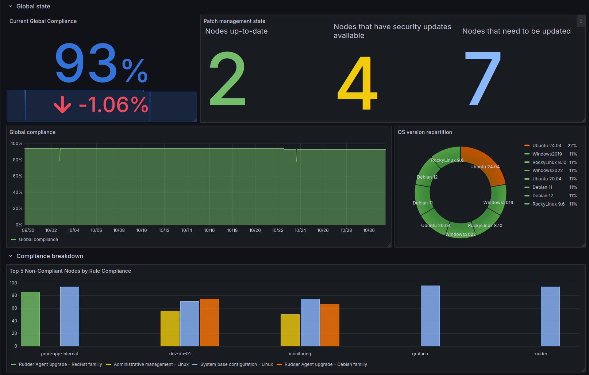

# Introduction

This is template for Rudder integration with Grafana.

# Installation

If you do not already have a usable MySQL instance, you can get one with docker:

```bash
$ docker network create --subnet=172.20.0.0/16 mysql_net

$ docker run --name grafana_mysql --network mysql_net --ip 172.20.0.100 -e MYSQL_ROOT_PASSWORD=password -d mysql:latest

```

Please follow official documentation for more information.


# Create tables in MySQL

Modify ``databasse.py`` to store your mysql credentials in variables ``DB_IP``, ``DB_USER``, ``DB_PASSWORD``. Then use the ``create_tables.py`` to create the SQL database and tables.

# Using `fill_grafana.py`
## Requirements

Create a python virtual env to install requirements:
```bash
$ python3 -m venv grafana_venv
$ source grafana_venv/bin/activate
```

Install the requirements:
```bash
$ pip install -r requirements.txt
```

Get your token for Rudder's API
```bash
$ echo "API_TOKEN=<your_token>" > .env
```

Modify RUDDER_ENDPOINT in the script according to your needs.

## Script's description

This script can be modified to import the data you want into your grafana instance.

The ``database.py`` contains one class **Database**. It connects to the database and manipulates it. The ``update_table`` function can be used to insert a row or update an existing one. In this file, you should modify the variables ``DB_IP``, ``DB_USER``, ``DB_PASSWORD`` according the needs.

The ``fill_grafana.py`` contains one class **RudderAPI** that connects to Rudder's API and fetches data. The variable ``RUDDER_ENDPOINT`` must be updated to match your rudder instance.

There is one fetch method for each data to be extracted from Rudder. The final block of code calls them an insert the data to the SQL database.
If you add more information, do no forget to update the database structure and the grafana dashboard too.

Grafana will later read that data.

# Grafana's dashboard configuration

This dashboard gives an example of what can be done with the data extracted from Rudder.

Please use the ``grafana_dashboard_jsonmodel.json`` to import the dashboard into Grafana.



# Crontab 

To have the data updated on a regular basis, add an executable file in /etc/crontab.daily to execute ``fill_grafana.py``. For example:
```bash
#!/bin/bash

cd /home/vagrant
source grafana_venv/bin/activate
python3 fill_grafana.py >> /tmp/grafana_log.log
```
