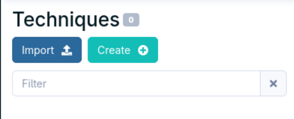
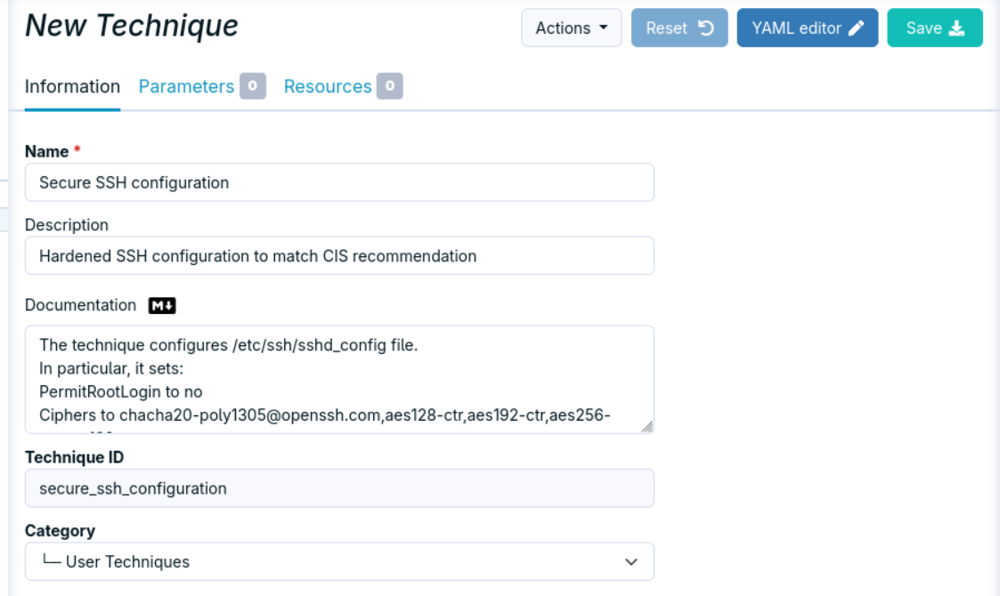

## Techniques Hub

This repository provides:

- **Ready-to-use techniques** that save time on common use cases
- **A review process** ensuring quality and consistency before anything is published
- **A central place** where anyone — customer or not — can find and contribute techniques

### What is a Technique ?

A technique defines a set of operations and configurations to reach the desired state of a system. This includes the initial set-up, but also a regular checks, and automatic repairs (when possible).
I can take parameters (string text or enum), either required or optional, to adapt the configuration via a directive and it can also have resources files (usually, templates)

Some techniques are built-in Rudder, and the rest can be built within the Technique Editor, or imported

### Organization

In this folder, each techniques are organized by category:

```
techniques/
├── hardening/
├── audit/
├── compliance/
└── ...
```

Each technique lives in its own directory within the appropriate category and includes the technique file and potential resources.


### Importing a Technique in Rudder

There are three main ways to import the technique in Rudder: two via UI (when there is no resources files, and one via CLI

1. **UI import** is for techniques that don't have resource files.

To import the techniques, you need to download the yaml file, and go to the Technique Editor and click on *Import*

.

you select the yaml file on your file system an import it. Then you can review the result, and save it

.

2. **UI edition** is for techniques that don't have resource files.

You can directly use the yaml content to copy and paste in a new technique. You have to go to the Technique Editor and create a new Technique

.

A new empty Technique is created, and you can click on YAML editor

.

The bottom of the text becomes editable, and you can copy and paste the YAML content, and then save the Technique

3. **CLI import**

In this case, you can also manage techniques with resources. You need to copy the techniques folder within the /var/rudder/configuration-repository/techniques folder, commit them, and reload the techniques from the local git repository.

```bash
root@server:/var/rudder/configuration-repository/techniques/ncf_techniques# cp -ar /tmp/techniques/
root@server:/var/rudder/configuration-repository/techniques/ncf_techniques# cp -ar /tmp/techniques/windows_password_policy .
root@server:/var/rudder/configuration-repository/techniques/ncf_techniques# git add windows_password_policy
root@server:/var/rudder/configuration-repository/techniques/ncf_techniques# git commit -am "Adding the windows password policy management technique"
[master 383ef1d] Adding the windows password policy management technique
 5 files changed, 1293 insertions(+)
 create mode 100644 techniques/ncf_techniques/windows_password_policy/1.0/metadata.xml
 create mode 100644 techniques/ncf_techniques/windows_password_policy/1.0/resources/audit.cfg
 create mode 100644 techniques/ncf_techniques/windows_password_policy/1.0/technique.cf
 create mode 100644 techniques/ncf_techniques/windows_password_policy/1.0/technique.ps1
 create mode 100644 techniques/ncf_techniques/windows_password_policy/1.0/technique.yml
root@server:/var/rudder/configuration-repository/techniques/ncf_techniques# rudder server reload-techniques
ok: reload techniques from files.
```

The technique will be available in the Technique Editor after a few instants.

## What's next for this repository?

- [ ] Add more techniques
- [ ] Add versionning for the individual techniques and repository (to match Rudder versions)
- [ ] Set up a CI job to check the techniques
- [ ] Ease the import/export of techniques

